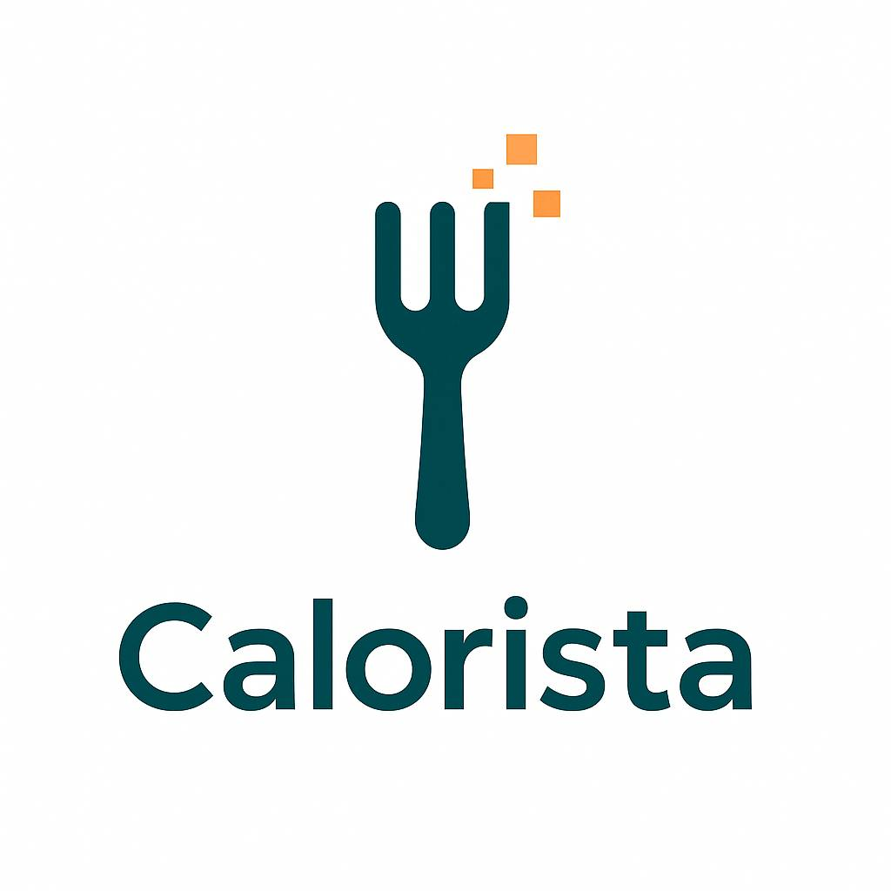

# calorista

Demo:

https://calorista.streamlit.app/

ETL pipeline for authenticated FatSecret users that extracts real-time food log data, transforms raw entries with detailed nutritional metadata.

## 🔑 API Access

To use this project, you must [register your application with FatSecret](https://platform.fatsecret.com/api/Default.aspx?screen=rapiintro) and obtain your own **API Key** and **API Secret**. This is required to authenticate users and access their food log data via the FatSecret Platform API.

Please remember that you need to also whitelist your IP inside your personal account settings.
